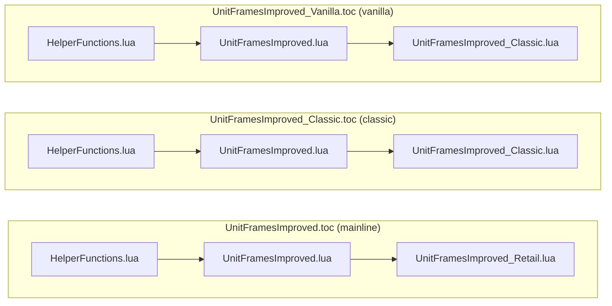
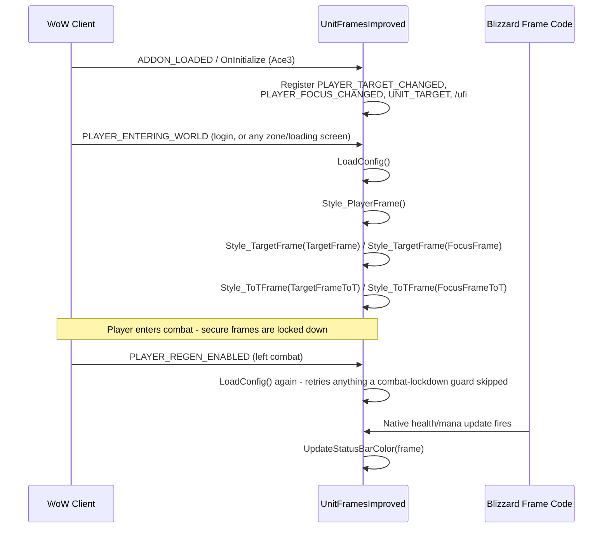
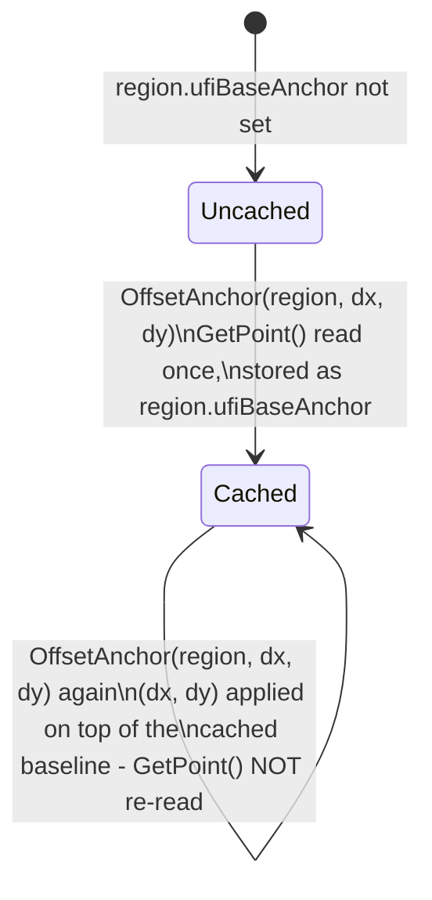
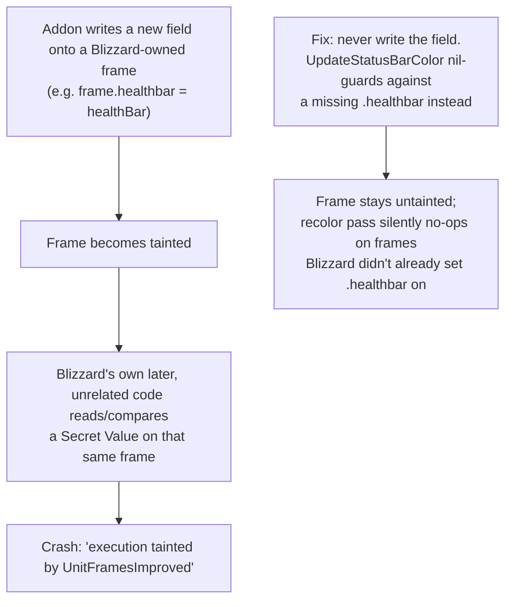
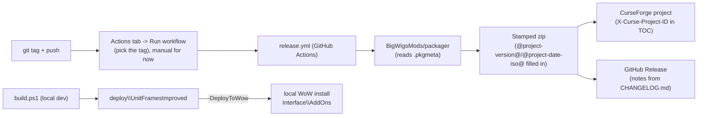

# Architecture

Technical reference for how UnitFramesImproved is put together. See [README.md](README.md) for
what the addon does and how to build it; this document is about how the code is structured and why.

## Design goal

Restyle Blizzard's own Player/Target/Focus frames in place - reuse Blizzard's existing frames,
regions, and update logic (health/mana updates, portraits, classification, PvP/faction icons,
combat behavior) and only touch positioning, sizing, textures, and color. The addon never creates
its own frame hierarchy and never replaces a Blizzard update function; it repositions/retextures
what's already there and, in one place, hooks a text-formatting function to observe (not replace)
Blizzard's own updates.

## File layout

| File | Role |
|---|---|
| `UnitFramesImproved.toc` / `_Classic.toc` / `_Vanilla.toc` | Per-client TOC files - see [Client split](#client-split) |
| `UnitFramesImproved.lua` | Shared logic: Ace3 addon setup, event handlers, `UpdateStatusBarColor`, `UnitColor`, `OffsetAnchor`, other small helpers used by both client stylers |
| `UnitFramesImproved_Retail.lua` | `Style_PlayerFrame`/`Style_TargetFrame`/`Style_ToTFrame` for Retail's nested `PlayerFrameContent`-style templates |
| `UnitFramesImproved_Classic.lua` | Same three functions for the Classic family (Classic Era/Vanilla and Classic progression), which still use the pre-Dragonflight flat, global-named frame templates |
| `HelperFunctions.lua` | `dout`/`DebugPrint`/`DebugPrintf` chat/debug-log output, `print_r` table dump |
| `Textures/` | Custom `.blp` textures (targeting frame variants, player status) |
| `Libs/` | Ace3 + LibStub, fetched as externals at package/build time - not committed (see [Build & packaging](#build--packaging)) |

Load order is declared per TOC file and is the same shape in all three - shared code first, then
the one client-specific styler file:

## Client split

Retail was rebuilt around nested templates (e.g.
`PlayerFrame.PlayerFrameContent.PlayerFrameContentMain.HealthBarsContainer.HealthBar`), while every
Classic variant still uses flat, globally-named frames from the pre-Dragonflight UI
(`PlayerFrameHealthBar`, `TargetFrameHealthBar`, etc.) - different enough that one shared styling
function isn't practical. `UnitFramesImproved.lua` only contains what's genuinely identical between
them (event wiring, color logic, the anchor-offset helper); everything that touches an actual frame
path lives in the client-specific file.

Classic Era/Vanilla and Classic progression share `UnitFramesImproved_Classic.lua` - they run the
same underlying flat-template UI, just gated by a different `AllowLoadGameType` per TOC file. When
Blizzard changes something between Classic client builds (see the recent `TextStatusBarMixin`
migration below), the code branches at runtime on what's actually present rather than forking the
file per client build.

## Lifecycle

1. `OnInitialize` (Ace3) registers `PLAYER_TARGET_CHANGED`, `PLAYER_FOCUS_CHANGED`, `UNIT_TARGET`,
   and the `/ufi` chat command.
2. `LoadConfig` runs on `PLAYER_ENTERING_WORLD` (fires on login *and* every zone/loading screen) and
   on `PLAYER_REGEN_ENABLED` (leaving combat - see [Combat lockdown](#combat-lockdown--taint-safety)).
   It calls each `Style_*Frame` function and is safe to call repeatedly: `OffsetAnchor` caches its
   own baseline (see below) and region creation is nil-checked, so re-running it just reasserts the
   same state rather than drifting or duplicating anything. The "Loading config.../Config loaded."
   debug lines only print on the first call, so repeated re-application (which is the normal case,
   not an error condition) doesn't spam chat.
3. `PLAYER_TARGET_CHANGED`/`PLAYER_FOCUS_CHANGED`/`UNIT_TARGET` re-style and re-color just the
   relevant frame when what it's showing changes.

## Anchoring pattern

Established the hard way (see git history around the Classic health bar layout fixes): a health
bar's position is neither a hardcoded constant nor a straight copy of Blizzard's live anchor - it's
a hybrid.

- **X tracks Blizzard's live value.** The custom textures' health-bar slot lines up with wherever
  Blizzard's own bar currently sits, so reading it live (`region:GetPoint()`) is both correct and
  future-proof against Blizzard moving it in a client update.
- **Y gets a fixed, addon-specific delta on top of Blizzard's live value**, because the custom
  texture's vertical layout doesn't match Blizzard's own.

`UnitFramesImproved:OffsetAnchor(region, dx, dy)` (`UnitFramesImproved.lua`) implements this: it
caches a region's *first-ever observed* anchor as `region.ufiBaseAnchor`, then applies `(dx, dy)` on
top of that cached baseline on every call, instead of re-reading `GetPoint()` and re-adding the
offset each time. This matters because some regions (e.g. `TargetFrameHealthBar`) are never reset
by Blizzard between target switches - re-adding an offset to whatever the *current* position already
is would compound further with every retarget. Regions Blizzard *does* reset unconditionally on
every call (e.g. Target frame's `Background`, reset by `CheckClassification` on every classification
check) must not use this cached pattern - they need a fresh `GetPoint()` read each time, applied
directly rather than through `OffsetAnchor`.

## Combat lockdown & taint safety

Only one operation here is genuinely combat-restricted: **creating new regions**
(`CreateFontString`/`CreateTexture`/`CreateFrame`) as children of a frame descended from a secure
template (Target/Focus frames use `SecureUnitButtonTemplate`). Repositioning, retexturing, resizing,
or recoloring an already-existing region is not restricted, regardless of whether that region is a
child of a secure frame. `InCombatLockdown()` guards in this codebase are scoped to just the
region-creation branches (Classic Target frame's fallback `CreateStatusBarText` calls, for clients
where Blizzard's own template didn't already provide the text objects) - everything else runs
unconditionally.

Because a guard *can* still legitimately skip something (e.g. that fallback creation, on a client
where Blizzard's template genuinely doesn't pre-populate it), `PLAYER_REGEN_ENABLED` re-runs
`LoadConfig` on leaving combat so anything skipped gets retried instead of staying unstyled/
uncreated for the rest of the session.

Separately, Retail's Secret Values system can make a health/mana value briefly unreadable by addon
code. `Style_PlayerFrame` (Retail) checks `issecretvalue()` before forcing a text update, and avoids
setting a custom `numericDisplayTransformFunc` entirely - Blizzard's own `capNumericDisplay` path
(already enabled on every health/mana bar by Blizzard's own `UnitFrame_Initialize`) reaches the same
"abbreviated numbers" result through a call marked safe to use even while tainted, instead of
through addon code that isn't.

**Frame taint is easy to trigger accidentally by simply writing a new field onto a Blizzard-owned
frame from insecure (addon) code** - this was hit directly during development: adding
`frame.healthbar = healthBar` to Retail's stylers (attempting to give `UpdateStatusBarColor` a
reference it needed) tainted the frame and made Blizzard's own later, otherwise-unrelated health
update throw `"execution tainted by 'UnitFramesImproved'"` the next time it compared a secret health
value on that frame. The fix was to not write that field at all - `UpdateStatusBarColor` nil-guards
against a missing `.healthbar` instead, so Retail's Player/Target/ToT frames simply skip the
addon's own recolor pass rather than crash. Classic's frames don't need this workaround: Blizzard's
own flat-template `UnitFrame_Initialize` already sets `.healthbar` natively there.

`Style_PlayerFrame` (Classic) sets `healthBar.lockColor = true` for a related reason: without it,
Blizzard's own native health-bar update keeps recoloring the bar on every health change, undoing the
addon's class-color `SetStatusBarColor` call almost immediately. `lockColor` tells that native update
to skip its own coloring, leaving the addon's call as the only one that actually sticks.

## Build & packaging

`.pkgmeta` declares `Libs/` (LibStub, CallbackHandler-1.0, and the three Ace3 modules actually used)
as SVN externals - the CurseForge packager fetches them at release time, so they're intentionally
not committed (`Libs/` is gitignored). `build.ps1` is a local stand-in for that packager: it fetches
the same externals over plain HTTP, stages a build into `deploy\UnitFramesImproved`, optionally
copies that build into a local WoW install's `Interface\AddOns` (see `-DeployToWow` below), and
stamps the `@project-version@`/`@project-date-iso@` TOC tokens from `git describe` (falling back to
`dev` outside a git checkout). See its own `Get-Help .\build.ps1 -Full` for parameters.

Actual publishing to CurseForge happens in CI, not from a developer machine:
[.github/workflows/release.yml](.github/workflows/release.yml) runs the same `BigWigsMods/packager`
the manual CurseForge upload flow used to require, authenticated via a `CF_API_KEY` repository
secret. It's triggered manually (`workflow_dispatch`) for now rather than automatically on tag
push - run it from the Actions tab and pick the tag to release. `build.ps1` never talks to
CurseForge - it only ever produces a local build for testing, either staged in `deploy/` or copied
into a live WoW install.
