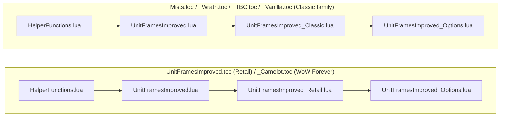
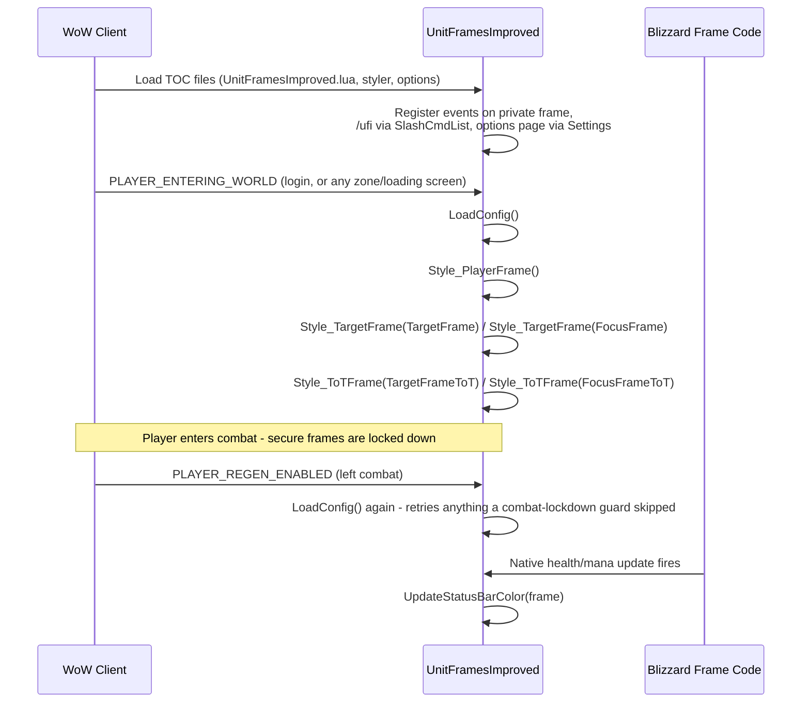
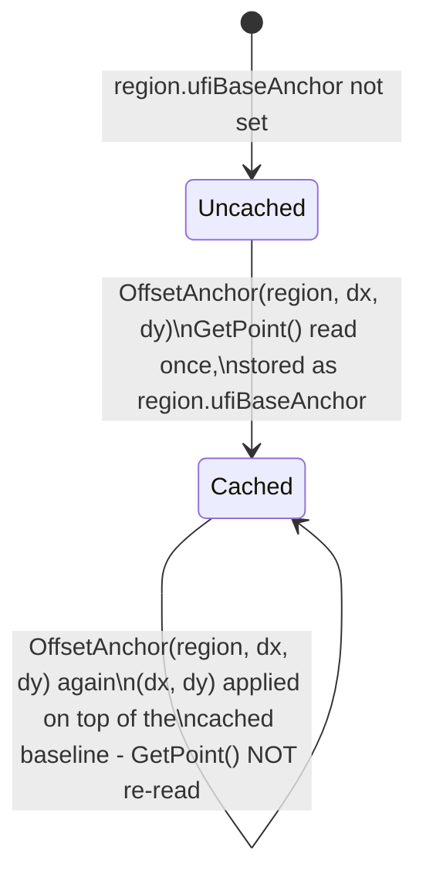
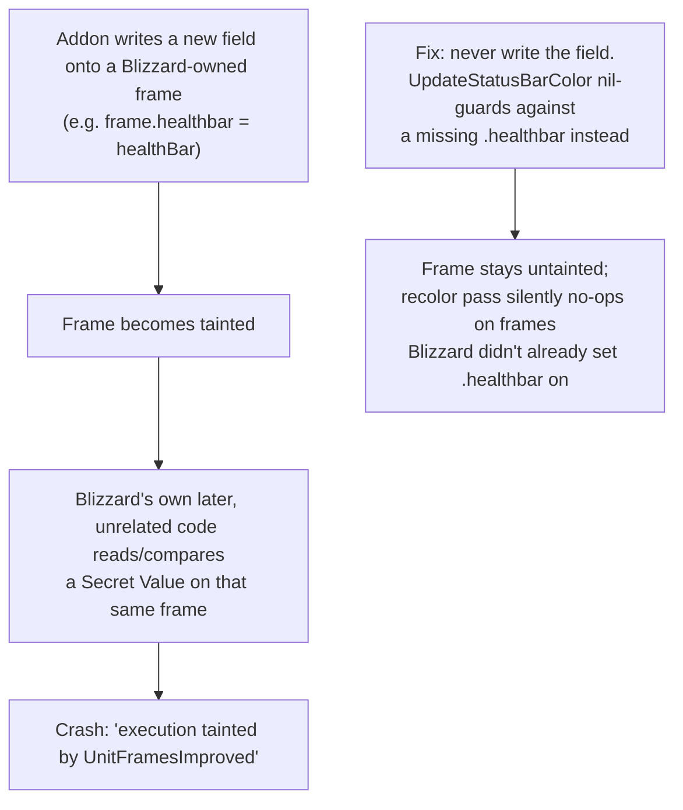
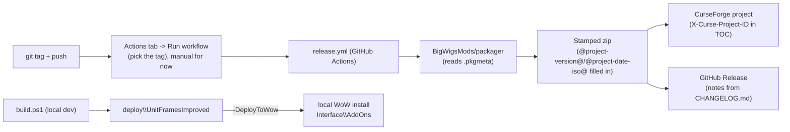

# Architecture

Technical reference for how UnitFramesImproved is put together. See [README.md](README.md) for
what the addon does and [DEVELOPMENT.md](DEVELOPMENT.md) for how to build/release it; this
document is about how the code is structured and why.

## Design goal

Restyle Blizzard's own Player/Target/Focus frames in place - reuse Blizzard's existing frames,
regions, and update logic (health/mana updates, portraits, classification, PvP/faction icons,
combat behavior) and only touch positioning, sizing, textures, and color. The addon never creates
its own frame hierarchy and never replaces a Blizzard update function; it repositions/retextures
what's already there and, in one place, hooks a text-formatting function to observe (not replace)
Blizzard's own updates.

## File layout

| File | Role |
|---|---|
| `UnitFramesImproved.toc` / `_Camelot.toc` / `_Mists.toc` / `_Wrath.toc` / `_TBC.toc` / `_Vanilla.toc` | Per-client TOC files - see [Client split](#client-split) |
| `UnitFramesImproved.lua` | Shared logic: addon table, event frame + slash commands, event handlers, `UpdateStatusBarColor`, `UnitColor`, `OffsetAnchor`, other small helpers used by both client stylers |
| `UnitFramesImproved_Retail.lua` | `Style_PlayerFrame`/`Style_TargetFrame`/`Style_ToTFrame` for the Mainline nested `PlayerFrameContent`-style templates (Retail and WoW Forever) |
| `UnitFramesImproved_Classic.lua` | Same three functions for the Classic family (Classic Era/Vanilla and Classic progression), which still use the pre-Dragonflight flat, global-named frame templates |
| `UnitFramesImproved_Options.lua` | The options page (Settings API) and its Status Text option - see [Options](#options) |
| `HelperFunctions.lua` | `dout`/`DebugPrint`/`DebugPrintf` chat/debug-log output, `print_r` table dump |
| `Textures/` | Custom `.blp` textures (targeting frame variants, player status) |
| `tests/` | Offline regression tests against a stubbed WoW client - never loaded or packaged, see [tests/README.md](tests/README.md) |

Load order is declared per TOC file and is the same shape in all of them - shared code first, then
the one client-specific styler file, then the (shared) options page:

```mermaid
flowchart LR
    subgraph M["UnitFramesImproved.toc (Retail) / _Camelot.toc (WoW Forever)"]
        direction LR
        H1[HelperFunctions.lua] --> S1[UnitFramesImproved.lua] --> F1[UnitFramesImproved_Retail.lua] --> O1[UnitFramesImproved_Options.lua]
    end
    subgraph C["_Mists.toc / _Wrath.toc / _TBC.toc / _Vanilla.toc (Classic family)"]
        direction LR
        H2[HelperFunctions.lua] --> S2[UnitFramesImproved.lua] --> F2[UnitFramesImproved_Classic.lua] --> O2[UnitFramesImproved_Options.lua]
    end
```

## Client split

Retail was rebuilt around nested templates (e.g.
`PlayerFrame.PlayerFrameContent.PlayerFrameContentMain.HealthBarsContainer.HealthBar`), while every
Classic variant still uses flat, globally-named frames from the pre-Dragonflight UI
(`PlayerFrameHealthBar`, `TargetFrameHealthBar`, etc.) - different enough that one shared styling
function isn't practical. `UnitFramesImproved.lua` only contains what's genuinely identical between
them (event wiring, color logic, the anchor-offset helper); everything that touches an actual frame
path lives in the client-specific file.

Classic Era/Vanilla and Classic progression share `UnitFramesImproved_Classic.lua` - they run the
same underlying flat-template UI, just with a different per-client TOC file. When Blizzard changes
something between Classic client builds (see the recent `TextStatusBarMixin` migration below), the
code branches at runtime on what's actually present rather than forking the file per client build.

Which files load is decided purely by which TOC the client picks - each client loads the TOC with
its own suffix and falls back to the unsuffixed `UnitFramesImproved.toc`:

| Client | TOC | Interface | Styler |
|---|---|---|---|
| Retail | `UnitFramesImproved.toc` | 12xxxx | `_Retail.lua` |
| WoW Forever | `UnitFramesImproved_Camelot.toc` | 16xxx | `_Retail.lua` |
| Mists of Pandaria Classic | `UnitFramesImproved_Mists.toc` | 50xxx | `_Classic.lua` |
| Wrath (Titan Reforged) | `UnitFramesImproved_Wrath.toc` | 3xxxx | `_Classic.lua` |
| TBC Anniversary | `UnitFramesImproved_TBC.toc` | 20xxx | `_Classic.lua` |
| Classic Era | `UnitFramesImproved_Vanilla.toc` | 11xxx | `_Classic.lua` |

**WoW Forever** (the "Camelot" game type in Blizzard's own UI code and TOC tags, installed under
`_classic_beta_` during its beta) is a Classic-era game built on Retail's Mainline UI: it shares
Midnight's API set, including Secret Values, and its unit frames are the Mainline templates with a
small set of Camelot overrides on top (level/PvP circles, boss/rare portrait art -
`Blizzard_UnitFrame/Camelot/` in its UI source). Nothing this addon styles is touched by those
overrides, so Forever runs `UnitFramesImproved_Retail.lua` unchanged. Its TOC suffix is `_Camelot`
(what both the client and the CurseForge packager look for); if a client ever doesn't recognize it,
it falls back to the unsuffixed Retail TOC, which loads the same styler.

## Lifecycle

1. At load, `UnitFramesImproved.lua` registers `PLAYER_ENTERING_WORLD`, `PLAYER_REGEN_ENABLED`,
   `PLAYER_TARGET_CHANGED`, `PLAYER_FOCUS_CHANGED` and `UNIT_TARGET` on one private event frame
   (each dispatched to the addon method of the same name), and `/ufi` + `/unitframesimproved`
   through `SlashCmdList`. `UnitFramesImproved_Options.lua` then registers the options page.
2. `LoadConfig` runs on `PLAYER_ENTERING_WORLD` (fires on login *and* every zone/loading screen) and
   on `PLAYER_REGEN_ENABLED` (leaving combat - see [Combat lockdown](#combat-lockdown--taint-safety)).
   It calls each `Style_*Frame` function and is safe to call repeatedly: `OffsetAnchor` caches its
   own baseline (see below) and region creation is nil-checked, so re-running it just reasserts the
   same state rather than drifting or duplicating anything. The "Loading config.../Config loaded."
   debug lines only print on the first call, so repeated re-application (which is the normal case,
   not an error condition) doesn't spam chat.
3. `PLAYER_TARGET_CHANGED`/`PLAYER_FOCUS_CHANGED`/`UNIT_TARGET` re-style and re-color just the
   relevant frame when what it's showing changes.

```mermaid
sequenceDiagram
    participant WoW as WoW Client
    participant UFI as UnitFramesImproved
    participant Blizz as Blizzard Frame Code

    WoW->>UFI: Load TOC files (UnitFramesImproved.lua, styler, options)
    UFI->>UFI: Register events on private frame,<br/>/ufi via SlashCmdList, options page via Settings

    WoW->>UFI: PLAYER_ENTERING_WORLD (login, or any zone/loading screen)
    UFI->>UFI: LoadConfig()
    UFI->>UFI: Style_PlayerFrame()
    UFI->>UFI: Style_TargetFrame(TargetFrame) / Style_TargetFrame(FocusFrame)
    UFI->>UFI: Style_ToTFrame(TargetFrameToT) / Style_ToTFrame(FocusFrameToT)

    Note over WoW,UFI: Player enters combat - secure frames are locked down

    WoW->>UFI: PLAYER_REGEN_ENABLED (left combat)
    UFI->>UFI: LoadConfig() again - retries anything a combat-lockdown guard skipped

    Blizz->>UFI: Native health/mana update fires
    UFI->>UFI: UpdateStatusBarColor(frame)
```

## Anchoring pattern

Established the hard way (see git history around the Classic health bar layout fixes): a health
bar's position is neither a hardcoded constant nor a straight copy of Blizzard's live anchor - it's
a hybrid.

- **X tracks Blizzard's live value.** The custom textures' health-bar slot lines up with wherever
  Blizzard's own bar currently sits, so reading it live (`region:GetPoint()`) is both correct and
  future-proof against Blizzard moving it in a client update.
- **Y gets a fixed, addon-specific delta on top of Blizzard's live value**, because the custom
  texture's vertical layout doesn't match Blizzard's own.

`UnitFramesImproved:OffsetAnchor(region, dx, dy)` (`UnitFramesImproved.lua`) implements this: it
caches a region's *first-ever observed* anchor as `region.ufiBaseAnchor`, then applies `(dx, dy)` on
top of that cached baseline on every call, instead of re-reading `GetPoint()` and re-adding the
offset each time. This matters because some regions (e.g. `TargetFrameHealthBar`) are never reset
by Blizzard between target switches - re-adding an offset to whatever the *current* position already
is would compound further with every retarget. Regions Blizzard *does* reset unconditionally on
every call (e.g. Target frame's `Background`, reset by `CheckClassification` on every classification
check) must not use this cached pattern - they need a fresh `GetPoint()` read each time, applied
directly rather than through `OffsetAnchor`.

```mermaid
stateDiagram-v2
    [*] --> Uncached : region.ufiBaseAnchor not set
    Uncached --> Cached : OffsetAnchor(region, dx, dy)\nGetPoint() read once,\nstored as region.ufiBaseAnchor
    Cached --> Cached : OffsetAnchor(region, dx, dy) again\n(dx, dy) applied on top of the\ncached baseline - GetPoint() NOT re-read
```

## Combat lockdown & taint safety

Only one operation here is genuinely combat-restricted: **creating new regions**
(`CreateFontString`/`CreateTexture`/`CreateFrame`) as children of a frame descended from a secure
template (Target/Focus frames use `SecureUnitButtonTemplate`). Repositioning, retexturing, resizing,
or recoloring an already-existing region is not restricted, regardless of whether that region is a
child of a secure frame. `InCombatLockdown()` guards in this codebase are scoped to just the
region-creation branches (Classic Target frame's fallback `CreateStatusBarText` calls, for clients
where Blizzard's own template didn't already provide the text objects) - everything else runs
unconditionally.

Because a guard *can* still legitimately skip something (e.g. that fallback creation, on a client
where Blizzard's template genuinely doesn't pre-populate it), `PLAYER_REGEN_ENABLED` re-runs
`LoadConfig` on leaving combat so anything skipped gets retried instead of staying unstyled/
uncreated for the rest of the session.

Separately, Retail's Secret Values system can make a health/mana value briefly unreadable by addon
code. `Style_PlayerFrame` (Retail) checks `issecretvalue()` before forcing a text update, and avoids
setting a custom `numericDisplayTransformFunc` entirely - Blizzard's own `capNumericDisplay` path
(already enabled on every health/mana bar by Blizzard's own `UnitFrame_Initialize`) reaches the same
"abbreviated numbers" result through a call marked safe to use even while tainted, instead of
through addon code that isn't.

**Frame taint is easy to trigger accidentally by simply writing a new field onto a Blizzard-owned
frame from insecure (addon) code** - this was hit directly during development: adding
`frame.healthbar = healthBar` to Retail's stylers (attempting to give `UpdateStatusBarColor` a
reference it needed) tainted the frame and made Blizzard's own later, otherwise-unrelated health
update throw `"execution tainted by 'UnitFramesImproved'"` the next time it compared a secret health
value on that frame. The fix was to not write that field at all - `UpdateStatusBarColor` nil-guards
against a missing `.healthbar` instead, so Retail's Player/Target/ToT frames simply skip the
addon's own recolor pass rather than crash. Classic's frames don't need this workaround: Blizzard's
own flat-template `UnitFrame_Initialize` already sets `.healthbar` natively there.

```mermaid
flowchart TD
    A["Addon writes a new field onto a Blizzard-owned frame\n(e.g. frame.healthbar = healthBar)"] --> B[Frame becomes tainted]
    B --> C["Blizzard's own later, unrelated code reads/compares\na Secret Value on that same frame"]
    C --> D["Crash: 'execution tainted by UnitFramesImproved'"]

    E["Fix: never write the field.\nUpdateStatusBarColor nil-guards against\na missing .healthbar instead"] --> F["Frame stays untainted;\nrecolor pass silently no-ops on frames\nBlizzard didn't already set .healthbar on"]
```

`Style_PlayerFrame` (Classic) sets `healthBar.lockColor = true` for a related reason: without it,
Blizzard's own native health-bar update keeps recoloring the bar on every health change, undoing the
addon's class-color `SetStatusBarColor` call almost immediately. `lockColor` tells that native update
to skip its own coloring, leaving the addon's call as the only one that actually sticks.

## Options

`UnitFramesImproved_Options.lua` registers **Options -> AddOns -> UnitFramesImproved** (also opened
by `/ufi`) with Blizzard's own Settings API (`Settings.RegisterVerticalLayoutCategory`,
`RegisterProxySetting`, `CreateDropdown`, `RegisterAddOnCategory`, `OpenToCategory`) - the same API
Blizzard's own options pages are built on. It's the standard way for addons to add options since
Dragonflight; the old `InterfaceOptions_AddCategory` path doesn't exist at all in Midnight's or WoW
Forever's UI code. Every client this addon ships to has the same Settings API with the same
signatures, so the file is shared rather than split per client, and it bails out early if the API
is ever missing.

Its one option, **Status Text**, exists because WoW Forever has no visible setting for showing
health/mana numbers on the unit frames. It's a re-exposed copy of Blizzard's own Status Text
dropdown (`Blizzard_SettingsDefinitions_Frame/Interface.lua`): same four values, same default, and
backed by the same two CVars (`statusTextDisplay` for the mode, `statusText` for on/off) rather
than by addon saved variables. Blizzard's status bars already read those CVars on every update, so
the option works on every client without the addon touching Blizzard's frames - and it stays in
sync with Blizzard's own dropdown wherever that still exists.

Writing the CVars isn't enough to redraw a bar's labels, though: `TextStatusBarMixin` only redraws
on a `statusText` `CVAR_UPDATE`, or when Blizzard's own Status Text setting (`PROXY_STATUS_TEXT`)
reports a change. A `statusTextDisplay`-only change (Numeric to Both, say) triggers neither, so
between two shown modes the addon turns `statusText` off and straight back on - the same as picking
None in between, and within one frame, so nothing flickers.

It can't redraw the bars itself, or fire that setting callback: on Retail and WoW Forever
`UnitHealth` is *always* secret (`SecretReturns = true` in the client's API docs, not tied to any
restriction), the redraw compares it, and started from addon code it runs tainted - so it errors on
every health bar (seen in game on Forever with `Settings.NotifyUpdate("PROXY_STATUS_TEXT")`).
Blizzard's `statusText` `CVAR_UPDATE` handler, run by our own `SetCVar`, redraws without erroring
even then (also seen in game on Forever).

The addon's `setValue` runs addon-tainted, and `CVAR_UPDATE` is a synchronous event, so Blizzard's
`TextStatusBarMixin` handler for `statusText` runs inside our `SetCVar` call. It doesn't error on
secret values out of combat (above), but to keep those handler runs to a minimum anyway:

- A CVar is only written if its value actually changes.
- While in combat, or while any addon restriction under which values can be secret is active
  (`C_RestrictedActions.IsAddOnRestrictionActive` for Combat/Encounter/ChallengeMode/PvPMatch/Map),
  the choice is held as pending instead (the dropdown shows it, and chat says it'll apply later).
  It's applied on `PLAYER_REGEN_ENABLED` / `ADDON_RESTRICTION_STATE_CHANGED`, re-checked one frame
  later via `C_Timer.After(0, ...)` - that event also fires just *before* a restriction activates,
  and `IsAddOnRestrictionActive` reports false throughout its dispatch.

The Retail stylers used to write `forceShow`/`textLockable` onto `PlayerFrame`/`TargetFrame` meaning
to force the text visible. Nothing reads those fields on the unit frame (only `TextStatusBarMixin`
reads them, on the bar itself), so they did nothing except write addon fields onto Blizzard's
frames - they're gone; showing the numbers is the Status Text option's job.

## Dependencies

None. The addon used to embed Ace3 (AceAddon/AceEvent/AceConsole, plus LibStub and
CallbackHandler), but only ever used it for what Blizzard's own API does directly on every client:
one frame with `RegisterEvent`/`OnEvent` for events, and `SLASH_*` + `SlashCmdList` for slash
commands. The options page uses Blizzard's Settings API rather than AceConfig/AceGUI. Dropping the
libraries removed the `.pkgmeta` externals, the `Libs/` folder, and `build.ps1`'s library fetching.

## Build & packaging

There are no externals: `.pkgmeta` just names the package and lists what not to ship (`build.ps1`,
`deploy`, `tests`, the developer docs). `build.ps1` is a local stand-in for the CurseForge packager:
it stages a build into `deploy\UnitFramesImproved`, optionally
copies that build into a local WoW install's `Interface\AddOns` (see `-DeployToWow` below), and
stamps the `@project-version@`/`@project-date-iso@` TOC tokens from `git describe` (falling back to
`dev` outside a git checkout). See its own `Get-Help .\build.ps1 -Full` for parameters. It copies
only the files it lists explicitly (`$SourceItems`), so anything else in the repo - `tests/`
included - never reaches a build; a test checks that list against the TOCs.

```mermaid
flowchart LR
    Tag["git tag + push"] --> Run["Actions tab -> Run workflow\n(pick the tag), manual for now"]
    Run --> CI["release.yml (GitHub Actions)"]
    CI --> Pkg["BigWigsMods/packager\n(reads .pkgmeta)"]
    Pkg --> Zip["Stamped zip\n(@project-version@/@project-date-iso@ filled in)"]
    Zip --> CF["CurseForge project\n(X-Curse-Project-ID in TOC)"]
    Zip --> GH["GitHub Release\n(notes from CHANGELOG.md)"]

    Dev["build.ps1 (local dev)"] --> Deploy["deploy\\UnitFramesImproved"]
    Deploy -->|"-DeployToWow"| WowInstall["local WoW install\nInterface\\AddOns"]
```

Actual publishing to CurseForge happens in CI, not from a developer machine:
[.github/workflows/release.yml](.github/workflows/release.yml) runs the same `BigWigsMods/packager`
the manual CurseForge upload flow used to require, authenticated via a `CF_API_KEY` repository
secret. It's triggered manually (`workflow_dispatch`) for now rather than automatically on tag
push - run it from the Actions tab and pick the tag to release. `build.ps1` never talks to
CurseForge - it only ever produces a local build for testing, either staged in `deploy/` or copied
into a live WoW install.
